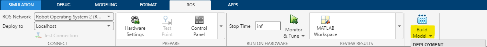
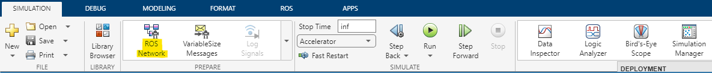

# Control Velocidad

[](https://opensource.org/licenses/MIT)

Control de Velocidad de avance del robot Turtlebot3 mediante reguladores de tipo PID usando ROS2. Los nodos de ROS2 se han creado usando la herramienta de Code Generation de Simulink. De esta forma, el alumno puede crear fácilmente los controles en un entorno en el que está familiarizado


## Installation

Este modelo está pensado para ser usado en MATLAB 2022a utilizando la librería ROS Toolbox.
Para empezar, se necesita instalar MATLAB y descargar el código de GitHub.

### Git

```bash
git clone https://github.com/FranciscoBarCa/Control-Velocidad.git
cd Control-Velocidad
matlab -r EnsayoControlVelocidad #Asegurarse es 2022a
```

En caso de no tener Git instalado puede descargar manualmente el repositiorio y descomprimirlo.

### Build Time_sec C/C++ Code Block

Antes de poder ejectuar el control hay que hacer un build al bloque Time_sec dentro del subsistema Envío ROS.

### Build Simulink

Una vez abierto el Simulink se ha de crear el código en C++ que se usa para crear el nodo en ROS2.
Para ello usamos la opcción Build model dentro de Deployment.



Nótese que en la sección de Connect se tiene seleccionadas las opciones de ROS Network: ROS2 y la opcción Deploy to: Localhost.

### Ajustes Adicionales

Si se quieren usar varios robots Turtlebot al mismo tiempo hay que cambiar el DOMAIN_ID dentro de ROS2 para que cada robot trabaje en un entorno separado. Este ajuste tiene que cambiarse tanto en el propio robot como en el Simulink. Para cambiarlo, hay que ir a ROS Network dentro de Prepare.



Dentro de este menú también se nos presenta la opcción de cambiar el middleware que usar en las comunicaciones. Existen tres opcciones soportadas por MATLAB.

- rmw_fastrtps_cpp (Default)
- rmw_fastrtps_dynamic_cpp
- rmw_cyclonedds_cpp

Normalmente la opcción por defecto no da problemas pero en caso contrario, se debe elegir rmw_cyclonedds_cpp. Este ajuste tambien ha de cambiarse en el archivo ConexionControlInterno.m.

## Usage

Una vez creado el nodo con el comando build, no hace falta volver a usar el EnsayoControlVelocidad.slx salvo que se quiera hacer algun cambio al control.
Para realizar el ensayo se usa la función EnsayoPC.m.

```MATLAB
[R,U,Y] = EnsayoPC(DOMAIN_ID,Tsim,ref)
```

Para invocar la función se especifica el dominio en el quese va a realizar el ensayo, el tiempo total de el ensayo y el tamaño del escalón a aplicar.
Esta función nos devuelve la referencia mando y salida del ensayo.
Estos datos se pueden usar para generar las gráficas del ensayo.

Se ha incluido también se ha includo un archivo plotEnsayosPC.m que incluye una implemenación de las gráficas del ensayo.

## Errores tipicos

- ### S-Function Builder Block 'EnsayoControIVeIocidad/Envio ROSIC,' /C\*+ Code Blockl' has encountered an error.
        No se ha realizado el pasoBuild Time_sec C/C++ Code Block. No seencuentran los archivos generados.
- ### Unable to generate code for model 'EnsayoControIVeIocicad', when an application with the same name as model is already running.
        Cerrar la aplicación command promt que hay abierta antes de volver a hacer deployment.
- ### No se encuentra el turtlebot3_node Asegurese que el robot está encendido y la configuración de domain es correcta
        Concectarse al robot por SSH y esperar a obtener en consola.
        [turtlebot3_ros-3] [INFO] [diff_drive_controller]: Run!
        En caso contrario el robot tiene un error en su código propio de ROS o alguno de sus componentes como LIDAR o motores no está conectado.
- ### Nodo '/EnsayoControlVelocidad' no encontrado en ROS2
        Error interno de ROS2 al generar el nodo de MATLAB.Reinicie el ordenador.Asegurese que no se ha cambiado el nombre de ningun archivo.

